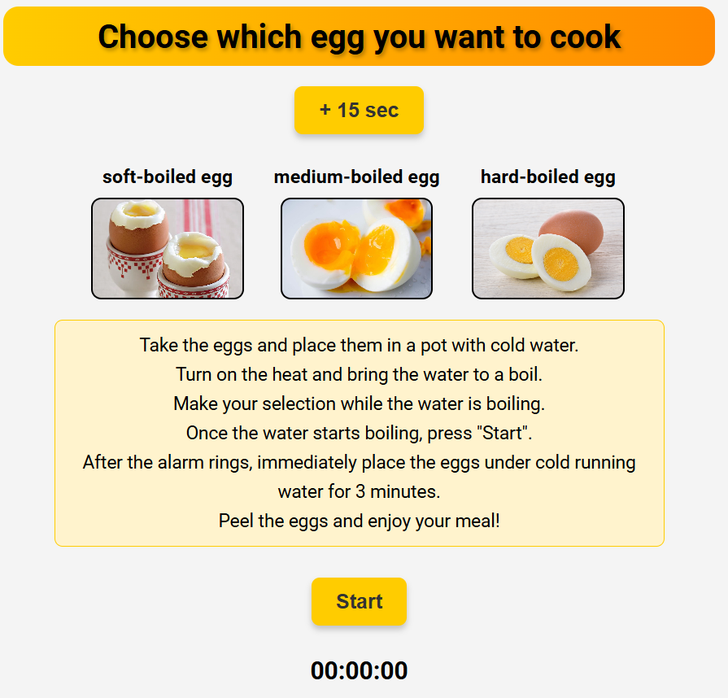

# 🍳 Egg Timer App

  
A simple and interactive **egg cooking timer** with a sleek design, modals, and alarm sounds.

---

## 📌 Features
✅ **Select Egg Type** – Soft-boiled, Medium-boiled, or Hard-boiled eggs.  
✅ **Countdown Timer** – Displays the time remaining.  
✅ **Interactive Buttons** – Each egg type sets a specific time.  
✅ **Alarm Sound** – Plays when the timer reaches 00:00:00.  
✅ **Modal Popup** – Shows a message when the eggs are ready.  
✅ **Mobile Responsive** – Works smoothly on desktop and mobile.  
✅ **Default Timer Behavior** – If the "Start" button is pressed without selecting an egg, the default time is 00:00:00, triggering the alarm immediately.

---

## 🛠 Technologies Used
- **HTML5** – Structure
- **CSS3** – Styling & Animations
- **JavaScript (ES6)** – Functionality
- **Font: Roboto** – Clean and modern typography

---

## 🎨 UI Preview


---

## 🚀 Installation & Usage
### 1️⃣ Clone the Repository
```sh
git clone https://github.com/yourusername/egg-timer-app.git
cd egg-timer-app
```

### 2️⃣ Open the Project
Simply open `index.html` in your browser.

### 3️⃣ Alternative: Run a Local Server
If you use VS Code, run:
```sh
npx live-server
```

---

## 📝 How to Use
1️⃣ **Choose an egg type** – Click on one of the egg images.  
2️⃣ **Start the timer** – Click the "Start" button.  
3️⃣ **Wait for the timer** – The countdown begins.  
4️⃣ **Eggs are ready!** – A modal pops up, and an alarm plays.  
5️⃣ **Close the modal** – Click the "OK" button or tap outside the modal.  
6️⃣ **Reset or select a new egg** – Click another egg or restart the timer.

---

## 🛠 Project Structure
```
📂 egg-timer-app
 ├── 📁 images          # Egg images
 ├── 📁 sounds          # Alarm sound file
 ├── 📄 index.html      # Main HTML file
 ├── 📄 style.css       # Stylesheet
 ├── 📄 script.js       # Main JavaScript file
 ├── 📄 README.md       # Project Documentation
```

---

## 🤝 Contributing
Feel free to **fork** this project, submit **issues**, or send **pull requests**. Any contributions are welcome!

---

## 📜 License
This project is open-source under the **MIT License**.
